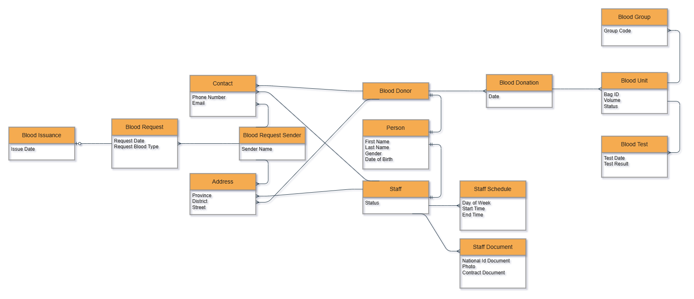

# Scenario
A blood bank information system is needed to manage staff, blood donors, blood donations, and blood units. Each donated blood unit is tested, and the test results are recorded before it is added to the blood inventory. Hospitals and clinics can request blood units, and the system tracks the issuance of blood to fulfill those requests.

# ER diagram 

# Relational Schema
- **Person**
    - id - PK
    - first_name - mandatory, alphabetic characters and spaces only
    - last_name - mandatory, alphabetic characters and spaces only
    - gender(Male, Female) - optional
    - date_of_birth - optional, past date only
    - created_at
    - updated_at
- **Staff**
    - person_id - PK, FK, on delete: cascade
    - role (Employee, Admin) - mandatory, default value(Employee)
    - status (Active, Inactive) - mandatory, default value(Active)
- **Document**
    - person_id - PK, FK, on delete: cascade
    - photo_url - mandatory, unique
    - tazkira_url - mandatory, unique
    - contract_url - mandatory, unique
    - created_at
    - updated_at
- **Schedule**
    - id - surrogate PK
    - person_id - FK, on delete: cascade, mandatory
    - day_of_week - mandatory
    - start_time - mandatory
    - end_time - optional
    - created_at
- **Address**
    - person_id - PK, FK, on delete: cascade
    - province - mandatory
    - district - mandatory
    - street - optional
    - created_at
    - updated_at
- **Contact**
    - person_id - PK, FK, on delete: cascade
    - email - optional, unique
    - whatsapp_number - optional
    - phone_number - mandatory, only Afghanistan phone number format
    - created_at
    - updated_at
- **Donor**
    - person_id - PK, FK, on delete: cascade
    - blood_group - mandatory
- **Donation**
    - id - surrogate PK
    - person_id - FK, mandatory
    - person_id - FK, mandatory
    - date - mandatory
    - created_at 
    - updated_at
- **Test**
    - donation_id - PK, FK, on delete:cascade
    - date - mandatory, must be the same as donation date
    - is_eligible - mandatory, default value(true)
    - created_at
- **Blood_Group**
    - group_code - PK
    - created_at
- **Blood_unit**
    - bag_id - PK
    - donation_id - FK, mandatory
    - groupd_id - FK, mandatory
    - volume - mandatory, between 450–500
    - status(Available, Issued, Discarded) - mandatory, default value(Available)
    - created_at
    - updated_at
- **Request_Sender**
    - id - surrogate PK
    - name - mandatory
    - created_at
    - updated_at
- **Blood_request**
    - id - surrogate PK
    - date - mandatory
    - blood_group_id - FK, mandatory
    - number_of_units - mandatory, only postive number
    - status(Rejected, Accepted, Pending)
    - created_at
    - updated_at
- **Blood_Issuance**    
    - request_id - PK, FK
    - date - mandatory
    - created_at 
