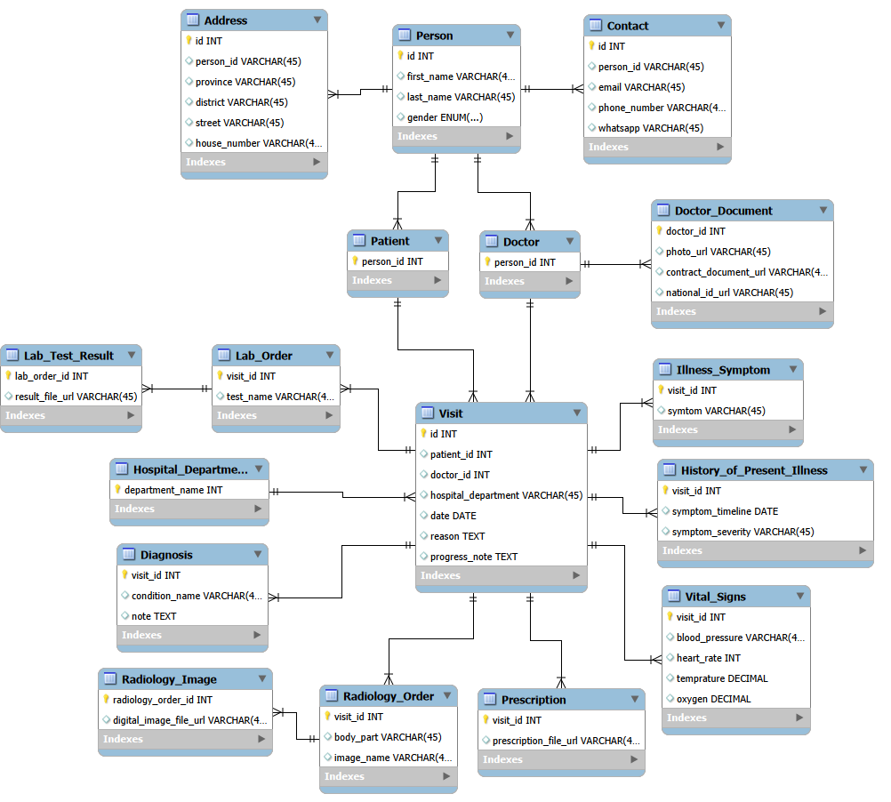

## Scenario
When patients arrive at the hospital, they are first registered and assigned a unique patient ID. After that, they can visit doctors in any department whenever needed, and each visit is recorded separately in their health record. During every visit, the doctor add visit details such as reason for the visit, illness symptoms and history, patient vital signs, diagnosis, lab or imaging orders, and prescriptions.

--- 

## Conceptual Design
### Domain Objects
- **Core Objects**
    - Patient
    - Doctor
    - Visit
    - Hospital Department

- **Supporting Objects**
    - Person: Base object for doctors and patients.
    - Address: Address information for doctors and patients.
    - Contact: Contact information for doctors and patients.
    - Doctor Document: Personal and professional documents for doctors.
    - History of Present Illness: Information about the patient's illness, including symptoms, severity, and timeline, recorded during a visit.
    - Vital Signs: Patient vital signs recorded during a visit.
    - Diagnosis: Confirmed diagnosis recorded during a visit.
    - Lab Order: Laboratory tests ordered during a visit.
    - Lab Test Result: Results of laboratory tests.
    - Radiology Order: Imaging tests ordered during a visit.
    - Radiology Image: Images produced from radiology tests.
    - Prescription: Medications prescribed during a visit.

### Attributes of Objects
- **Person**
    - First Name
    - Last Name
    - Gender
    - Date of Birth
- **Contact**
    - Email
    - Phone Number
    - Whatsapp Number
- **Address**
    - Province
    - District
    - Street
    - House Number
- **Patient**
- **Doctor Document**
    - Photo
    - Contract Document 
    - National Id
    - CV Document
- **Hospital Department**
    - Department Name
- **Doctor**
    - Status (Active/Leaft/On Break)
- **History of Present Illness**
    - Symptoms
    - Symptom Timeline
    - Symptom Severity
- **Vital Signs**
    - Blood Pressure
    - Heart Rate
    - Temperature
    - Oxygen saturation
- **Diagnosis**
    - Condition Name
    - Note
- **Lab Order**
    - Test Name
- **Lab Test Result**
    - Result File
- **Radiology Order**
    - Body Part
    - Image Name
- **Radiology Image**
    - Digital Image File
- **Prescription**
    - Prescription File
- **Visit**
    - Date
    - Reason
    - Progress Note

---

## Logical Design
### Tables
- **Person**
    - id - surrogate PK; 
    - fist_name - mandatory; only letters and spaces allowed;
    - last_name - mandatory; only letters and spaces allowed;
    - gender - mandatory;
    - date_of_birth - optional; only past dates allowed;
    - created_at - mandatory;
- **Contact**
    - id - surrogate PK;
    - person_id - FK; on delete: cascade; mandatory;
    - email - mandatory; unique;
    - phone_number - mandatory; 
    - whatsapp_number - optional;
    - created_at - mandatory;
    - updated_at - mandatory;
- **Address**
    - id - surrogate PK;
    - person_id - FK; on delete: cascade; mandatory;
    - province - mandatory;
    - district - mandatory;
    - street - optional; 
    - house_number - optional
    - created_at - mandatory;
    - updated_at - mandatory;
- **Patient**
    - Person_id - PK, FK; on delete: cascade; 
- **Doctor**
    - person_id - PK; FK; on delete: cascade;
- **Doctor_Document**
    - doctor_id - PK; FK; on delete: cascade; 
    - photo_url - mandatory;
    - contract_document_url - mandatory;
    - national_id_ulr - mandatory; unique
    - cv_document_url - mandatory;
    - created_at - mandatory;
    - updated_at - mandatory;
- **Hospital_Department**
    - department_name - PK;  
    - created_at - mandatory;
    - updated_at - mandatory;
- **Visit**
    - id - surrogate PK; 
    - patient_id - FK; mandatory;
    - doctor_id - FK; mandatory;
    - hospital_department_id - FK; mandatory;
    - date - mandatory;
    - reason - optional; 
    - progress_note - optional;
    - created_at - mandatory;
    - updated_at - mandatory;
- **Illness_Symptom**
    - visit_id - PK; FK; 
    - symptom - mandatory;
    - created_at - mandatory;
- **History_of_Present_Illness**
    - visit_id - PK; FK; 
    - symptom_timeline - mandatory;
    - symptom_severity - mandatory;
    - created_at - mandatory;
- **Vital_Signs**
    - visit_id - PK; FK; 
    - blood_pressure - mandatory;
    - heart_rate - mandatory; must be between 0 and 300; 
    - temperature - mandatory; must be between 30 and 45;
    - oxygen_saturation - mandatory; must be between 0 and 100 percent;
    - created_at - mandatory;
- **Diagnosis**
    - visit_id - PK; FK; 
    - condition_name - mandatory;
    - note - optional;
    - created_at - mandatory;
- **Lab_Order**
    - visit_id - PK; FK; 
    - test_name - mandatory;
    - created_at - mandatory;
    - updated_at - mandatory;
- **Lab_Test_Result**
    - lab_order_id - PK; FK;
    - result_file_url - mandatory; unique;
    - created_at - mandatory;
- **Radiology_Order**
    - visit_id - PK; FK;  
    - body_part - mandatory;
    - image_name - mandatory;
    - created_at - mandatory;
    - updated_at - mandatory;
- **Radiology_Image**
    - radiology_order_id - PK, FK;
    - digital_image_file_url - mandatory; unique;
    - created_at - mandatory;
- **Prescription**
    - visit_id - PK, FK; 
    - prescription_file_url - mandatory; unique;
    - created_at - mandatory;

### ERD

--- 

## Physical Design

--- 

## Database Usage
