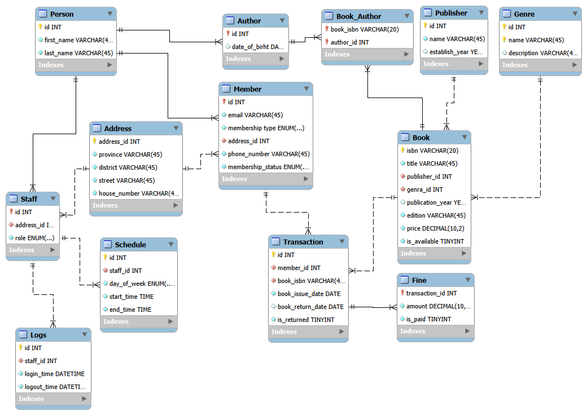

## Scenario
### Khorshid Library 
Khorshid Library is a private library located in Kabul City. Right now, the library is managed using a paper-based system. Staff manually write down records for books, members, and book loans. This often causes problems like mistakes in records, missing information, and slow daily work for both staff and management.

Because of these issues, the library needs a proper database system to make everything more organized, accurate, and easier to manage. So, the goal is to design and build a database that handles the core library operations in a structured way.

What this database should do
- Keep a proper record of all books in the library
- Make it easy to track when books are borrowed and returned
- Help quickly search books and check if they are available
- Store staff information in an organized way
- Keep track of fines for late returns and whether they are paid
- Control access based on staff and manager roles

In this project, I designed and implemented the database. I also demonstrate how to use it directly without an application layer.

---

## Conceptual Model
### Domain Objects 
- **Core Khorshid Library Objects**
    - Book
    - Staff
    - Member
- **Supporting Objects**
    - Person: Base object for staff, members, and authors.
    - Author: Information about book authors.
    - Publisher: Information about book publishers.
    - Genre: Book genre information.
    - Schedule: Staff work schedules.
    - Log: Staff activity logs.
    - Book Transaction: Records of book borrowing and returning.
    - Fine: Details of late return fines.
    - Address: Address information for staff and members.

### Attributes of Objects
- **Address**
    - province 
    - district 
    - street 
    - house_number 
- **Person**
    - first_name
    - last_name
- **Author**
    - date_of_birth
- **Member**
    - email 
    - membership_type: values:Basic/Standard/Premium
    - phone_number 
    - membership_status: values:Active/Expired
- **Staff**
    - role: values:Admin/Employee
- **Publisher**
    - name
    - establish_year 
- **Genre**
    - name 
    - description 
- **Book**
    - isbn 
    - title 
    - publication_year 
    - edition 
    - price 
- **Book_Transaction**
    - book_issue_date 
    - due_date 
- **Fine**
    - amount 
- **Schedule**
    - day_of_week 
    - start_time 
    - end_time 
- **Log**
    - login_time
    - logout_time

---

## Logical Design
### Tables
- **Address**
    - address_id - Surrogate PK, INTEGER; auto-generated unique identifier for each address
    - province- VARCHAR, Mandatory
    - district - VARCHAR, Mandatory
    - street - VARCHAR, Mandatory
    - house_number - VARCHAR, Mandatory
    - created_at - TIMESTAMP, Mandatory, Default value(Current Timestamp)
    - update_at - TIMESTAMP, Mandatory, Default value(Current Timestamp)
- **Person**
    - id - Surrogate PK, INTEGER; auto-generated unique identifier for each Person
    - first_name - VARCHAR, Mandatory,  only alphabet and space
    - last_name - VARHCAR, Mandatory, only alphabet and space
    - created_at - TIMESTAMP, Mandatory, Default value(Current Timestamp)
    - update_at - TIMESTAMP, Mandatory, Default value(Current Timestamp)
- **Author**
    - id - PK, INTEGER, FK -> Person.id, on delete:cascade; Uses shared primary key with its supertype (Person)
    - date_of_birth - DATE, Optional, Only past date
    - created_at - TIMESTAMP, Mandatory, Default value(Current Timestamp)
    - update_at - TIMESTAMP, Mandatory, Default value(Current Timestamp)
- **Member**
    - id - PK, INTEGER, FK -> Person.id, on delete:cascade, Uses shared primary key with its supertype (Person)
    - email - VARCHAR, Mandatory, unique
    - membership_type ENUM(Basic/Standard/Premium), Mandatory, Default value(Basic)
    - address_id - INTEGER, Mandatory, FK -> Addresses.id; links member to his/her address
    - phone_number- VARCHAR, Mandatory, length <= 13
    - membership_status - ENUM(Active/Expired), Mandatory, Default value(Active)
    - created_at - TIMESTAMP, Mandatory, Default value(Current Timestamp)
    - update_at - TIMESTAMP, Mandatory, Default value(Current Timestamp)
- **Staff**
    - id - PK, INTEGER, FK -> Person.id, on delete:cascade; Uses shared PK with its supertype (Person)
    - address_id - INTEGER, Mandatory, FK -> Addresses.id; links staff to his/her address
    - role - ENUM(Admin/Employee), Mandatory, Default value(Employee)
    - created_at - TIMESTAMP,  Mandatory, Default value(Current Timestamp)
    - updated_at - TIMESTAMP, Mandatory, Default value(Current Timestamp)
- **Publisher**
    - id - Surrogate PK, INTEGER; auto-generated unique identifier for each Publisher
    - name - VARCHAR, Mandatory, unique
    - establish_year - YEAR, Optional, Only past date
- **Genre**
    - id - Surrogate PK, INTEGER; auto-generated unique identifier for each Genre
    - name - VARCHAR, Mandatory, unique
    - description - TEXT, Optional
- **Book**
    - isbn - PK, VARCHAR; Natural unique identifier for each book
    - title - VARCHAR, Mandatory
    - publisher_id - INTEGER, Mandatory, FK -> Publishers.id; Links Book to its Publisher
    - genre_id -  INTEGER, Mandatory, FK -> Genres.id; Links Book it its Genre
    - publication_year - YEAR, Optional, Only past date
    - edition - INTEGER, Optional, edition > 0
    - price - DECIMAL, Mandatory, price > 0
    - is_available - BOOLEAN, Mandatory, Default value(true)
    - created_at - TIMESTAMP, Mandatory, Default value(Current Timestamp)
    - update_at - TIMESTAMP, Mandatory, Default value(Current Timestamp)
- **Book_Author**
    - book_isbn - VARCHAR, Mandatory, FK -> Book.ISBN; Links the Book
    - author_id - INTEGER, Mandatory, FK -> Authors.id; Links the Author of the Book
    - PK (book_isbn, author_id); Ensures each Book and its Author pair is unique
- **Book_Transaction**
    - id - Surrogate PK, INTEGER; auto-generated unique identifier for each Book_Transaction
    - member_id - INTEGER, Mandatory, FK -> Members.id; Links Transaction to the Member
    - book_isbn - VARCHAR, Mandatory, FK -> Books.ISBN; Links the Transaction to the Book
    - book_issue_date - DATE, Mandatory, Default value(Current date)
    - due_date - DATE, Mandatory
    - is_returned - BOOLEAN, Mandatory, Default value(false)
    - created_at - TIMESTAMP, Mandatory, Default value(Current Timestamp)
- **Fine**
    - book_transaction_id - Pk, INTEGER, FK -> Transactions.id; uses shared primary key with the transaction it belongs to
    - amount - DECIMAL, Mandatory, Default value(0), amount >= 0
    - is_paid - BOOLEAN, Mandatory, Default value(false)
    - created_at - TIMESTAMP, Mandatory, Default value(Current Timestamp)
- **Schedule**
    - id - Surrogate PK, INTEGER; auto-generated unique identifier for each Schedule
    - staff_id - INTEGER, Mandatory, FK -> Staff.id, on delete: cascade; Links Schedule to the staff it belongs to
    - day_of_week - ENUM(days of week), Mandatory
    - start_time - TIME, Mandatory
    - end_time - TIMESTAMP, Optional, 
    - created_at - TIMESTAMP, Mandatory, Default value(Current Timestamp)
- **Log**
    - id - Surrogate PK, INTEGER; auto-generated unique identifier for each Log
    - staff_id - INTEGER, Mandatory, FK -> Staff.id, on delete:cascade; Links to the Staff the Log belongs to
    - login_time - DATETIME, Mandatory, Default value(Current Date)
    - logout_time - TIMESTAMP, Optional, logout_time > login_time
    - created_at - TIMESTAMP, Mandatory, Default value(Current Timestamp) 

### ERD

---

## Physical Design 
### Indexing
- **Address Table**
    - Composite index on (province, district, street)  
- **Person Table**
    - Composite index on (firstname, last name)  
- **Book Table**
    - Index on genre id 
    - Index on publisher id  
    - Index on title 
- **Book_Author Table**
    - Index on author id: This index ensures optimized queries when filtering by author id alone
- **Book_Transaction Table**
    - Index on member id  
    - Index on book isbn    
    - Composite index on (member id, is returned): Supports queries identifying returned vs. unreturned books per member.
    - Composite index on (book isbn, is returned): Optimizes retrieval of return status for specific books.
- **Schedule Table**
    - Index on staff id
- **Logs Table**
    - Index on staff id

### Partitioning 
In this database, no tables require partitioning due to data size; however, for learning purposes, partitioning strategies can be applied as follow based on their access patterns. 
Since these columns are not part of the primary key, MySQL does not support this partitioning, but some DBMSs like PostgreSQL can handle it. 
- **Address Table**
    - Partitioned by province: Supported in PostgreSQL, but not in MySQL.
- **Author Table**
    - Partitioned by date of birth
- **Member Table**
    - Partitioned by membership status
    - Partitioned by membership type
- **Staff Table**
    - Partitioned by role
- **Book Table**
    - Partitioned by publisher id
    - Partitioned by genre id
    - Partitioned by publication year
- **Transaction Table**
    - Partitioned by book issue date
- **Log Table**
    - Partitioned by login time

---

## Database Usage
The database should be able to support the following use case queries:

- **Staff Queries**
    - Full Staff Profile by id: Person + Staff + Address
    - List all Staff with full profile, supports(sorting & pagination)
    - List Staff Logs, supports(sorting & pagination)
    - List Staff Schedules, supports(sorting & pagination)
    - Search Staff by fist name/last name, supports(sorting & pagination) 
- **Member Queries**
    - Full Member Profile by id/email: Person + Member + Address
    - List all Member with full Profile, supports(sorting & pagination)
    - List all Member transactions, supports(sorting & pagination)
    - List all Member fines, supports(sorting & pagination)
    - List Members based on membership type, supports(sorting & pagination)
    - List Members based on membership status, supports(sorting & pagination)
    - Search Member by first name/last name, supports(sorting & pagination)
- **Book Queries**
    - Full Book Profile by isbn: Book, Authors, Genre, Publisher
    - List all Books with full profile, supports(sorting & pagination)
    - List all book transactions, supports(sorting & pagination)
    - List Books of an Author, supports(sorting & pagination)
    - List Authors of a Book, supports(sorting & pagination)
    - List Books based on publisher, supports(sorting & pagination)
    - List Books based on genre, supports(sorting & pagination)
    - List Books based on publication year, supports(sorting & pagination)
    - List Books based on price range, supports(sorting & pagination)
    - List all available Books, supports(sorting & pagination)
    - Search Book by title, supports(sorting & pagination)
- **Other Queries**
    - Full Profile of Author by id: Person + Author
    - List all Authors with full profile, supports(sorting & pagination)
    - List all Publishers, supports(sorting & pagination)
    - List all Genres, supports(sorting & pagination)
    - List all Transactions, supports(sorting & pagination)
    - List all Fines, supports(sorting & pagination)
    - List all unpaied/Paid Fines,supports(sorting & pagination)
    - List all Schedules, supports(sorting & pagination)
    - List all Logs, supports(sorting & pagination)
    - Search Author by first name/last name, supports(sorting & pagination) 
    - Search Publisher by id/name, supports(sorting & pagination)
    - Search Genre by id/name, supports(sorting & pagination)
- **Dashboard Queries**
    - **Core**
        - Total Authors
        - Total Members
        - Total Publishers
        - Total Genres
        - Total Books
        - Total Transactions
        - Sum of Fines
        - Total available Books
        - Total unavailable Books
        - Total unpaid Fines
        - Min Books Price
        - Max Books Price
        - Average Books Price
        - Percentage/ratio of Members membership types
        - Percentaeg/ratio of Members membership status
        - Percentage/ration of Book availablity
        - Distribution of Books Price
        - Variance of Books Price
        - Standard Deviation of Books Price
        - Total books issued per month
    - **Segmented**
        - Total Members per province
        - Total Members per membership type
        - Total Members per membership status
        - Total Books per publisher
        - Total Books per genre
        - Total Books available
        - Total Books unavailable
        - Total Books per Author
        - Total Transaction per Member
        - Total Transaction per Book
        - Total Logs per Staff
        - Total Schedule per Staff
    - **Ranking**
        - Top 5 province with most Members
        - Top 3 Authors with most Books
        - Top 3 Genre with most Books
        - Top 3 Publisher with most Books
        - Top 10 Members with most Transactions
        - Top 10 Books with most Transactions
        - Top 3 Staff with most Schedules 
    - **Comparative** 
        - Compare province based on their total Members
        - Compare membership types by their total of Transactions
        - Compare Genre based on their Transactions

**To simplify the process of writing the above use case queries and data insertion, we first define and implement supporting views, functions, triggers, transactions, and procedures.**

### Views 
To simplify data retrieval for queries that require joins these views are needed:
- Staff Views
    - Full Staff Profile: Person + Staff + Address
    - Staff Logs: Person + Staff + Log
    - Staff Schedules: Person + Staff + Schedule
- Member Views
    - Full Member Profile: Person + Member + Address
    - Member Fines: Fine + Transaction + Member + Person
    - Member Transactions: Book_Transaction + Member + Book
- Book Views
    - Book Details: Book + Publisher + Genre
    - Book Authors: Book_Author + Person
    - Full Author Profile: Person + Author

### Functions
Some of dashboard Queries need these helper functions:
- Member total fine function
- Member transaction count function 
- Book availability check function

### Triggers
To automatically run these events we need these triggers:
- Book Issue Trigger: Mark Book as unavailable
- Book Return Trigger: Mark Book as available

### Transactions
To ensure that data remains consistent during business operations, we define these transactions: 
- Member Registration Transaction: Add full profile of a Member: Person + Member + Address
- Staff Registration Transaction: Add full profile of a Staff: Person + Staff + Address
- Author Registration Transaction: Add full profile of an Author: Person + Author

### Procedures
To automate transactions, we define them inside stored procedures. Therefore, the following procedures are required: 
- Member Registration Procedure
- Staff Registration Procedure
- Author Registration Procedure

### Access Control
Before inserting seed data and implementing the use-case queries, access control is defined and enforced to restrict which operations each user can perform within the database.

The system contains two database users: Admin and Employee
- **Admin:** Has full privileges on the Library Management database and can create, read, update, and delete all data across the system.
- **Employee:** Has restricted privileges. Employees can manage library-related records such as books, members, authors, publishers, genres, transactions, and fines, but they are not permitted to access or manage Staff, Schedule, or Log data.

**Now, we will create separate database connections for each user and log in using their respective accounts. After that, we will insert seed data into the database either through direct table inserts or through transactional stored procedures, and then proceed with writing and executing the use-case queries.**