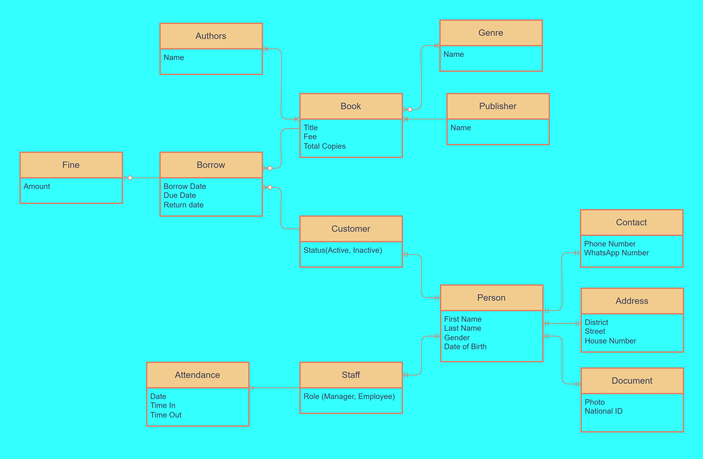

# Overview
This database project is designed for a library management system. The system is used by managers and staff members and supports the following use cases:
- Both managers and staff members can sign up, log in to the system, and manage their own profiles.
- Both can perform full CRUD operations on customers and books.
- Both can record book borrowings and returns, and create or update fines for overdue books.
- Both can record their daily check-in and check-out times.
- Managers can view staff attendance records and access staff account details.

# Entity Relationship Diagram (ERD)

# Relational Schema
- **Person**
    - id - Surrogate PK
    - first_name - mandatory,  only alphabet and space
    - last_name - mandatory, only alphabet and space
    - created_at - mandatory
    - update_at - mandatory
- **Address**
    - person_id - PK, FK, on delete: cascade
    - district - mandatory
    - street - mandatory
    - house_number - mandatory
    - created_at - mandatory
    - update_at - mandatory
- **Contact**
    - person_id - PK, FK, on delete: cascade
    - phone_number - mandatory, only AFG format
    - whatsapp_number - optional
    - created_at - mandatory
    - updated_at - mandatory
- **Document**
    - person_id - PK, FK, on delete: cascade
    - photo_url - mandatory, unique
    - nationa_id_url - mandatory, unique
    - created_at - mandatory
    - updated_at - mandatory
- **staff**
    - person_id - PK, FK, on delete: casacde
    - role (Manager, Employee) - mandatory
    - created_at - mandatory
    - updated_at - mandatory
- **Attendance**
    - id - surrogate PK
    - date - mandatory
    - time_in - optional 
    - time_out - optional
    - created_at - mandatory
- **Customer**
    - person_id - PK, FK, on delete: cascade
    - status (Active, Inactive) - mandatory, defualt(Active)
    - created_at - mandatory
    - updated_at - mandatory
- **Publisher**
    - name - PK
    - creatd_at - mandatory
    - updated_at - mandatory
- **Genre**
    - name - PK
    - created_at - mandatory
    - updated_at - mandatory
- **Author**
    - name - PK, only alphabet and space
    - created_at - mandatory
    - updated_at - mandatory
- **Book**
    - id - surrogate PK
    - publisher_id - FK - mandatory
    - title - mandatory
    - fee - mandatory, between 20-100
    - total_copies - mandatory, only positive
    - created_at - mandatory
    - updated_at - mandatory
- **Book_Genre**
    - book_id - FK, mandatory
    - genre_name - FK, mandatory
    PK(book_id, genre_name)
- **Book_Author**
    - book_id - FK, mandatory
    - author_name - FK, mandatory
    PK(book_id, author_id)
- **Borrow**
    - id - surrogate PK
    - book_id - FK - mandatory
    - customer_id - PK - mandatory
    - borrow_date - mandatory
    - due_date - mandatory, after borrow date
    - return_date - optional, after or same as borrow date
    - created_at - mandatory
    - updated_at - mandatory
- **Fine**
    - borrow_id - PK, FK
    - amount - mandatory, bigger then 10
    - created_at - mandatory
    - updated_at - mandatory

## Physical Design 
### Indexing
- **Address Table**
    - Composite index on (province, district, street)  
- **Person Table**
    - Composite index on (firstname, last name)  
- **Book Table**
    - Index on genre id 
    - Index on publisher id  
    - Index on title 
- **Book_Author Table**
    - Index on author id: This index ensures optimized queries when filtering by author id alone
- **Book_Transaction Table**
    - Index on member id  
    - Index on book isbn    
    - Composite index on (member id, is returned): Supports queries identifying returned vs. unreturned books per member.
    - Composite index on (book isbn, is returned): Optimizes retrieval of return status for specific books.
- **Schedule Table**
    - Index on staff id
- **Logs Table**
    - Index on staff id

### Partitioning 
In this database, no tables require partitioning due to data size; however, for learning purposes, partitioning strategies can be applied as follow based on their access patterns. 
Since these columns are not part of the primary key, MySQL does not support this partitioning, but some DBMSs like PostgreSQL can handle it. 
- **Address Table**
    - Partitioned by province: Supported in PostgreSQL, but not in MySQL.
- **Author Table**
    - Partitioned by date of birth
- **Member Table**
    - Partitioned by membership status
    - Partitioned by membership type
- **Staff Table**
    - Partitioned by role
- **Book Table**
    - Partitioned by publisher id
    - Partitioned by genre id
    - Partitioned by publication year
- **Transaction Table**
    - Partitioned by book issue date
- **Log Table**
    - Partitioned by login time

---

## Database Usage
The database should at least support the following use case queries:

- **Staff Queries**
    - Full Staff Profile by id: Person + Staff + Address
    - List all Staff with full profile, supports(sorting & pagination)
    - List Staff Logs, supports(sorting & pagination)
    - List Staff Schedules, supports(sorting & pagination)
    - Search Staff by fist name/last name, supports(sorting & pagination) 
- **Member Queries**
    - Full Member Profile by id/email: Person + Member + Address
    - List all Member with full Profile, supports(sorting & pagination)
    - List all Member transactions, supports(sorting & pagination)
    - List all Member fines, supports(sorting & pagination)
    - List Members based on membership type, supports(sorting & pagination)
    - List Members based on membership status, supports(sorting & pagination)
    - Search Member by first name/last name, supports(sorting & pagination)
- **Book Queries**
    - Full Book Profile by isbn: Book, Authors, Genre, Publisher
    - List all Books with full profile, supports(sorting & pagination)
    - List all book transactions, supports(sorting & pagination)
    - List Books of an Author, supports(sorting & pagination)
    - List Authors of a Book, supports(sorting & pagination)
    - List Books based on publisher, supports(sorting & pagination)
    - List Books based on genre, supports(sorting & pagination)
    - List Books based on publication year, supports(sorting & pagination)
    - List Books based on price range, supports(sorting & pagination)
    - List all available Books, supports(sorting & pagination)
    - Search Book by title, supports(sorting & pagination)
- **Other Queries**
    - Full Profile of Author by id: Person + Author
    - List all Authors with full profile, supports(sorting & pagination)
    - List all Publishers, supports(sorting & pagination)
    - List all Genres, supports(sorting & pagination)
    - List all Transactions, supports(sorting & pagination)
    - List all Fines, supports(sorting & pagination)
    - List all unpaied/Paid Fines,supports(sorting & pagination)
    - List all Schedules, supports(sorting & pagination)
    - List all Logs, supports(sorting & pagination)
    - Search Author by first name/last name, supports(sorting & pagination) 
    - Search Publisher by id/name, supports(sorting & pagination)
    - Search Genre by id/name, supports(sorting & pagination)
- **Dashboard Queries**
    - **Core**
        - Total Authors
        - Total Members
        - Total Publishers
        - Total Genres
        - Total Books
        - Total Transactions
        - Sum of Fines
        - Total available Books
        - Total unavailable Books
        - Total unpaid Fines
        - Min Books Price
        - Max Books Price
        - Average Books Price
        - Percentage/ratio of Members membership types
        - Percentaeg/ratio of Members membership status
        - Percentage/ration of Book availablity
        - Distribution of Books Price
        - Variance of Books Price
        - Standard Deviation of Books Price
        - Total books issued per month
    - **Segmented**
        - Total Members per province
        - Total Members per membership type
        - Total Members per membership status
        - Total Books per publisher
        - Total Books per genre
        - Total Books available
        - Total Books unavailable
        - Total Books per Author
        - Total Transaction per Member
        - Total Transaction per Book
        - Total Logs per Staff
        - Total Schedule per Staff
    - **Ranking**
        - Top 5 province with most Members
        - Top 3 Authors with most Books
        - Top 3 Genre with most Books
        - Top 3 Publisher with most Books
        - Top 10 Members with most Transactions
        - Top 10 Books with most Transactions
        - Top 3 Staff with most Schedules 
    - **Comparative** 
        - Compare province based on their total Members
        - Compare membership types by their total of Transactions
        - Compare Genre based on their Transactions

**To simplify the process of writing the above use case queries and data insertion, we first define and implement supporting views, functions, triggers, transactions, and procedures.**

### Views 
To simplify data retrieval for queries that require joins these views are needed:
- Staff Views
    - Full Staff Profile: Person + Staff + Address
    - Staff Logs: Person + Staff + Log
    - Staff Schedules: Person + Staff + Schedule
- Member Views
    - Full Member Profile: Person + Member + Address
    - Member Fines: Fine + Transaction + Member + Person
    - Member Transactions: Book_Transaction + Member + Book
- Book Views
    - Book Details: Book + Publisher + Genre
    - Book Authors: Book_Author + Person
    - Full Author Profile: Person + Author

### Functions
Some of dashboard Queries need these helper functions:
- Member total fine function
- Member transaction count function 
- Book availability check function

### Triggers
To automatically run these events we need these triggers:
- Book Issue Trigger: Mark Book as unavailable
- Book Return Trigger: Mark Book as available

### Transactions
To ensure that data remains consistent during business operations, we define these transactions: 
- Member Registration Transaction: Add full profile of a Member: Person + Member + Address
- Staff Registration Transaction: Add full profile of a Staff: Person + Staff + Address
- Author Registration Transaction: Add full profile of an Author: Person + Author

### Procedures
To automate transactions, we define them inside stored procedures. Therefore, the following procedures are required: 
- Member Registration Procedure
- Staff Registration Procedure
- Author Registration Procedure

### Access Control
Before inserting seed data and implementing the use-case queries, access control is defined and enforced to restrict which operations each user can perform within the database.

The system contains two database users: Admin and Employee
- **Admin:** Has full privileges on the Library Management database and can create, read, update, and delete all data across the system.
- **Employee:** Has restricted privileges. Employees can manage library-related records such as books, members, authors, publishers, genres, transactions, and fines, but they are not permitted to access or manage Staff, Schedule, or Log data.

**Now, we will create separate database connections for each user and log in using their respective accounts. After that, we will insert seed data into the database either through direct table inserts or through transactional stored procedures, and then proceed with writing and executing the use-case queries.**