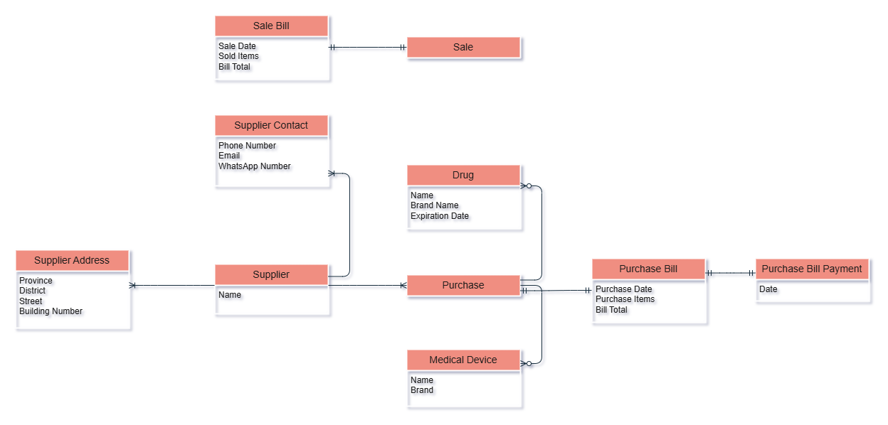

## Scenario
### Maihan Pharmacy 

Maihan Pharmacy is located in Kabul and currently operates without an electronic information system to manage its daily activities. As a result, the pharmacy faces significant challenges in managing drug inventory, tracking payments, monitoring drug expiration dates, and handling other operational processes. To improve efficiency and ensure better management, the pharmacy owner plans to implement an electronic information system.

The system should support the following functions:
- Management of drug and medical device inventory
- Storage of supplier information and contact details
- Purchase billing and sales billing
- Purchase payments management

In this project, I design and implement the database that will serve as the foundation of this pharmacy information system. Also demonstrates how use directly the database with no API or appliation layer.

--- 

## Conceptual Design
### Domain Objects
- **Core Objects**
    - Purchase: Handle acquisition of drugs and medical devices from suppliers
    - Medical Device
    - Drug
    - Sale: Handle Selling drugs and medical devices to customers

- **Supporting Objects**    
    - Supplier
    - Supplier Contact: Communication details of supplier
    - Supplier Address: Location details of supplier
    - Purchase Bill: Holds the complete bill information for a purchase
    - Payment: Payment details for a purchase bill
    - Sale Bill: Holds the complete bill information for a sale
 
### Objects Relationships
- Each Purchase is made from one Supplier
- Each Supplier has one or more Addresses and Contacts
- Each Purchase may include many Drugs and Medical Devices
- Each Purchase generates one Purchase Bill
- Each Purchase Bill generates one Payment
- Each Sale generates one Sale Bill

### Objects Attributes
- **Supplier**
    - Name
- **Supplier Address**
    - Province
    - District
    - Street
    - Building Number
- **Supplier Contact**
    - Phone Number
    - Email
    - Whatspp Number
- **Purchase Bill**
    - Purchase Date
    - Purchased Items
    - Bill Total
- **Purchase Bill Payment**
    - Date
- **Medical Device**
    - Name
    - Brand Name
- **Drug**
    - Name 
    - Brand Name
    - Expiration Date
- **Purchase**
- **Sale Bill**
    - Sale Date
    - Sold Items
    - Bill Total
- **Sale**

### ERD

---

## Logical Design

--- 

## Physical Design

--- 

## Database Usage