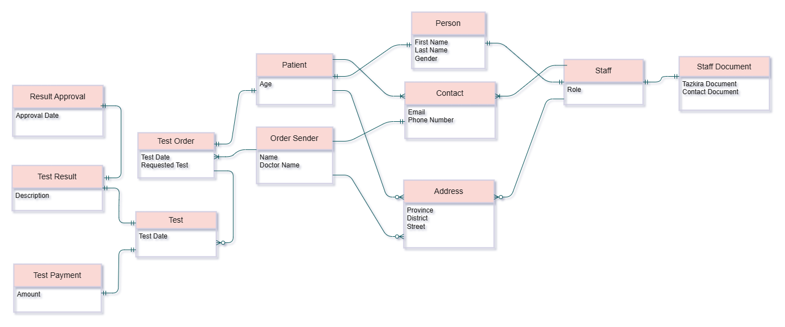

## Scenario
### Mosavi Medical Laboratory 
Mosavi Medical Laboratory has been serving clients for over 10 years in Kabul. It is a privately owned and independent laboratory and is not part of any hospital. In recent years, the lab has been using a simple information system; however, this system does not fully meet its operational needs. Therefore, the owner plans to upgrade it and develop a more advanced system.

The current system only allows storage of basic patient information and test results. However, the new system is expected to support the following features:
- Manage Staff (technicians/supervisor) and their daily works
- Manage Test Orders
- Manage Tests
- Manage Test Results
- Manage Tests Payments
- Mange Test Approvals by supervisor

In this project, I design and implement the database for this information system. Additionally, I demonstrate how the database can be used directly without an application layer.

--- 

## Conceptual Design
### Domain Objects:
- **Core Labratory Objects**
    - Staff 
    - Test Order
    - Test
- **Supporting Objects**
    - Person: Base object for staff and patients.
    - Address: Address information for staff, patients, and order senders.
    - Contact: Contact information for staff, patients, and order senders.
    - Staff Document: Personal and professional documents for staff.
    - Order Sender: Information about the sender of a test order.
    - Patient: Information about patients.
    - Test Result: Results of laboratory tests.
    - Test Payment: Payment details for laboratory tests.
    - Test Result Approval: Records of test result approvals.

### Attributes of Object
- **Person**
    - First Name
    - Last Name
    - Gender
- **Address**
    - Province
    - District
    - Street
- **Contact**
    - Email
    - Phone Number
- **Staff Document**
    - Tazkira Document
    - Contract Document
- **Staff**
    - Role
- **Order Sender**
    - Name
    - Doctor Name
- **Patient**
    - Age
- **Test Order**
    - Order Date
    - Requested Test
- **Test Result**
    - Description
- **Test Payement**
    - Amount
- **Test Approval**
    - Approval Date
- **Test**
    - Test Date

### ERD

---

## Logical Design

--- 

## Physical Design

--- 

## Database Usage