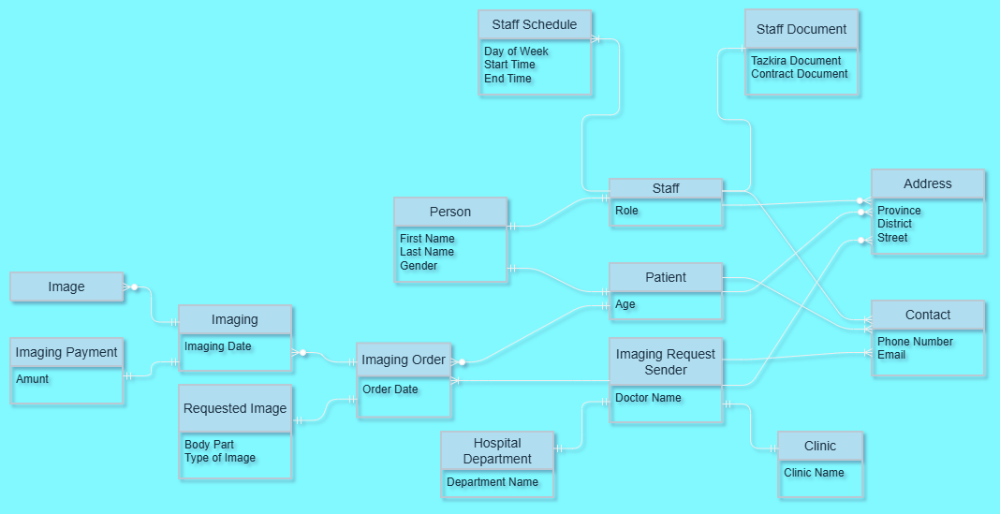

## Scenario
### Radiology 
This database is designed and implemented for a electronic information system to support the operations of a hospital radiology department. It is not developed for a specific hospital; instead, it provides a generic solution that can be adapted by any hospital.

Many radiology departments in Afghanistan still rely on paper-based processes. This can lead to various challenges, including loss of patient information, misidentification of imaging records, workflow delays, security concerns, and many more.

A typical radiology information system should support the following functions:
- Management of radiology staff and their work activities
- Management of imaging orders received from other hospital departments/Other clinics
- Management of patients
- Management of imaging procedures
- Management of medical images 
- Management of imaging payments

In addition to the design and implementation of the database, this project also demonstrates how the database can be used directly without an application layer, allowing users to perform common operational tasks through database queries and procedures.

--- 

## Conceptual Design
### Domain Objects:
- **Core Radiology Objects**
    - Staff (Technicians, Manager)
    - Imaging Order
    - Imaging

- **Supporting Objects:**
    - Person: supertype for Staff and Patient  
    - Contact: communication details of Staff, Request Sender, and Patient  
    - Address: location details of Staff, Request Sender, and Patient  
    - Staff Document: staff personal details  
    - Staff Schedule: staff presence in the lab  
    - Imaging Request Sender: imaging order identifier details  
    - Clinic: details of the clinic sending the imaging request  
    - Hospital Department: identification details of the hospital department sending the imaging request  
    - Patient: personal details of the person for whom the imaging is issued  
    - Requested Image: details of the type of image to be performed  
    - Image: images generated after imaging patients  
    - Imaging Payment: supports the payment process / holds details of imaging payments

### Attributes of Objects
- **Person**
    - First Name
    - Last Name
    - Gender
- **Staff**
    - Role
- **Imaging Order**
    - Order Date
- **Imaging**
    - Imaging Date
- **Contact**
    - Phone Number
    - Email
- **Address**
    - Province
    - District
    - Street
- **Staff Document**
    - Tazkira/National ID Card Docuemnt
    - Contract Document
- **Staff Schedule**
    - Day of Week
    - Start Time
    - End Time
- **Imaging Request Sender**
    - Doctor Name
- **Clinic**
    - Clinic Name
- **Hospital Department**
    - Department Name
- **Patient**
    - Age
- **Requested Image**
    - Body Part
    - Type of Image
- **Image**
- **Imaging Payment**
    - Amount

### Relationships Between Objects
- Each Person is the supertype of a Staff Member or a Patient.
- Each Staff, Patient, or Request Sender can be associated with many Contacts and Addresses.
- Each Staff has exactly one Staff Document.
- Each Staff Member can generate many Staff Schedules.
- Each Imaging Request Sender can send many Imaging Order.
- Each Imaging Request Sender is either a Hospital Department or an external Clinic.
- Each Imaging Order is issued for one Patient.
- Each Imaging Order may needs many Imaging
- Each completed Imaging Procedure produces one or more Images.
- Each completed Imaging Procedure requires a corresponding Payment

### ERD

---

## Logical Design
### Tables

### Normalization Notes

### Tables

--- 

## Physical Design

--- 

## Database Usage