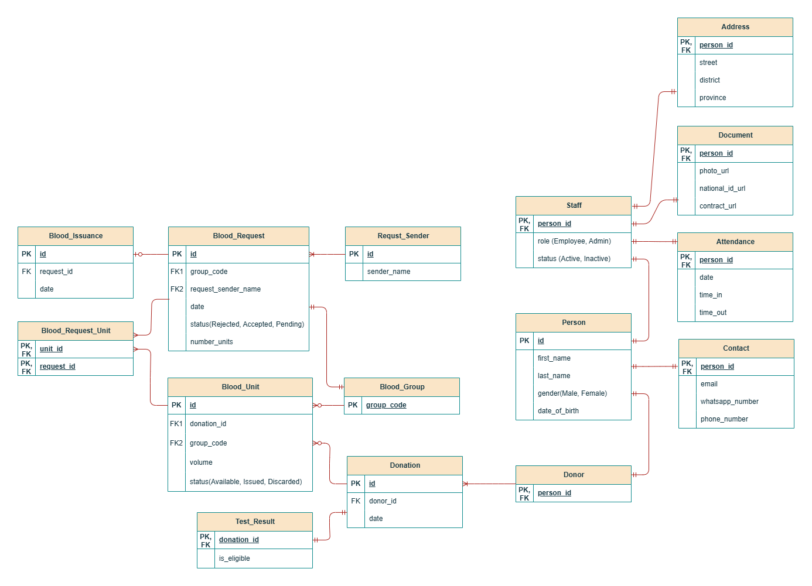

This database project is designed for a blood bank information system. The system is used by managers and staff members and supports the following use cases:
- Both managers and staff can sign up and log in to the system.
- Both can add and update their profile details, such as contact information, address, and personal documents.
- Managers can view the complete profiles of all staff members.
- Both managers and staff can record their daily check-in and check-out times.
- Managers can view the attendance records of all staff members.
- Both can register blood donors, record blood donations, and save donation test results.
- Both can manage the blood unit inventory.
- Both can manage blood requests and the organizations or people who submit them.
- Both can manage the issuance of blood units to approved requests.

# ER diagram 

 
