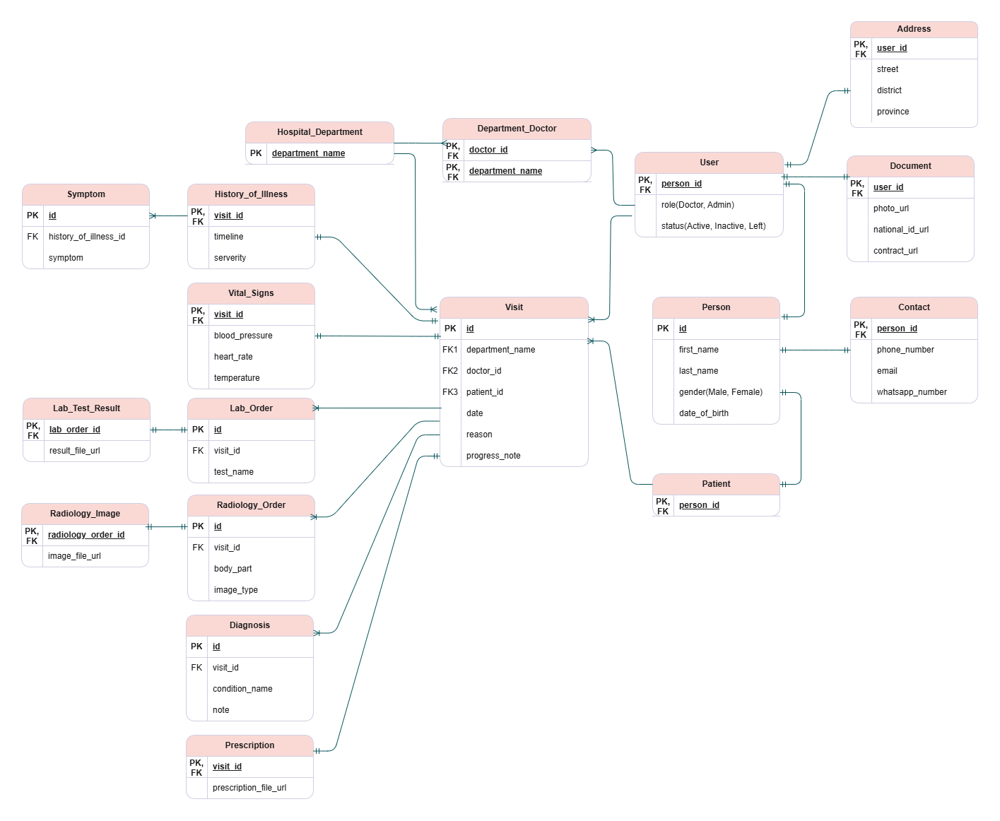

This database project is designed for a Health Record System. The system is used by doctors and administrators and supports the following scenario: When a patient visits the hospital for the first time, a doctor registers the patient. Once registered, the patient can visit doctors in any department whenever needed, and each visit is recorded separately in the patient's health record. During every visit, the doctor add visit details such as reason for the visit, illness symptoms and history, patient vital signs, diagnosis, lab or imaging orders, and prescriptions. Administrators can view and manage the complete records of doctors, patients, and patient visits.

# Entity Relationship Diagram (ERD)

